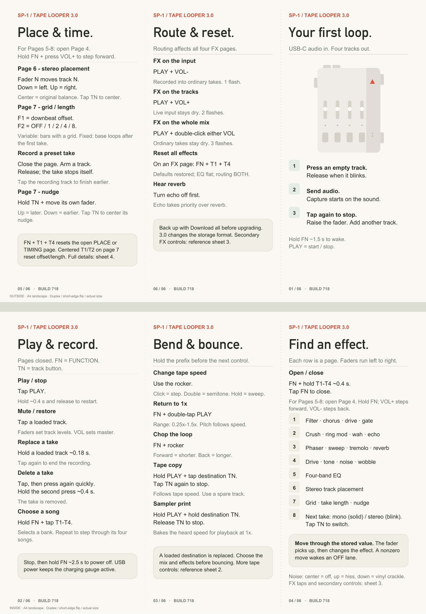
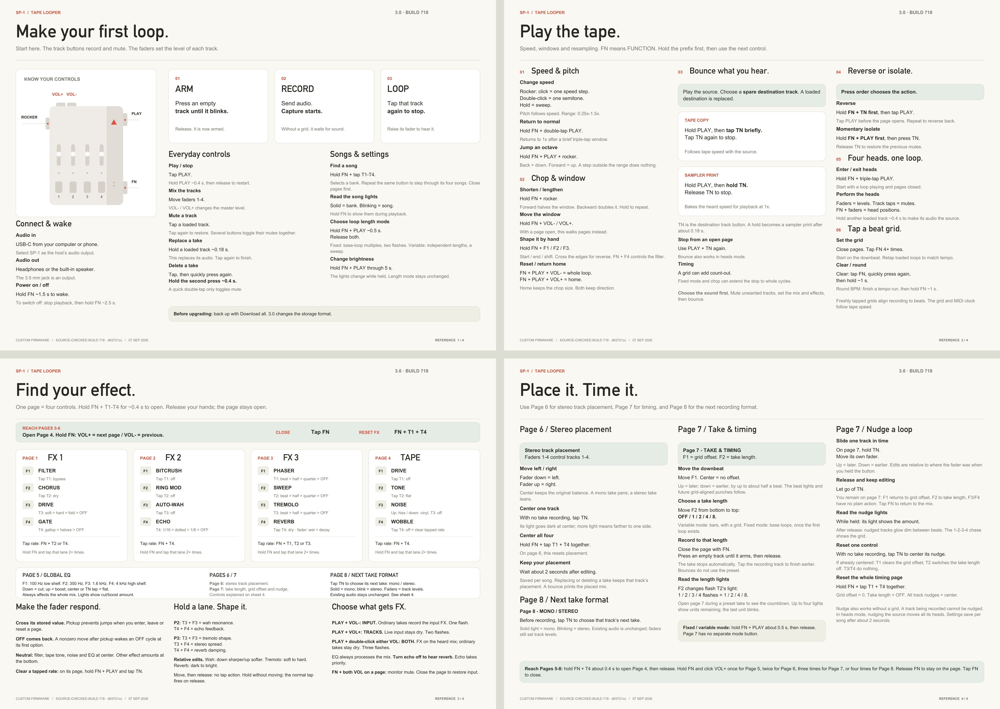

# SP-1 Tape Looper

A tape-machine-style looper for the Teenage Engineering SP-1: four loop
tracks per song, sixteen remembered songs in four banks.

This is custom firmware that turns the SP-1 stem player into a hands-on tool
for building layered loops. You feed audio in over USB-C (the SP-1 appears on
your computer or phone as a USB sound card / speaker), record loops with the
four track buttons, and they play back layered together through the speaker or
headphones. The rocker changes playback speed and pitch together, like tape.
Everything — loops, tempo/pitch, chop, placement, loop mode — persists per song
on the SP-1's internal flash, surviving power-off and re-flashing.

## What's new in 3.0

3.0 is stereo. Takes record and play in stereo (mono per take if you want the
storage bandwidth). On top of that: eight effect pages on the faders (filter,
chorus, distortion, gate, bitcrush, ring mod, wah, echo, phaser, sweep,
tremolo, reverb, tape drive / tone / hiss / wobble, a 4-band EQ, stereo
placement, take timing), effects on the input or the tracks or both, bounce
(tape copy and sampler print), reverse and isolate per track, octave jumps,
a speed range of 0.25×–1.5×, and a beat grid that stays locked to the loops.
The dropouts at max speed with USB audio in are gone.

Everything is listed per release in [CHANGELOG.md](CHANGELOG.md). The classic
4-song 1.x line lives on the `v1` branch; 2.x is tagged `v2.7.2-official`.

**Updating from 2.x is a format break.** Back up first: open the transfer
page, *Download all*. Flash. The first boot formats the card and every song on
it is gone. Then *Upload many* to restore. Songs recorded on 3.0 survive
later 3.x flashes.

## Flashing it onto the SP-1

The SP-1 is flashed with the Solderless updater (the same tool used for any
SP-1 custom firmware) — no soldering or opening the device required:

1. Open the Solderless SP-1 update tool: <https://solderless.engineering>
2. Connect the SP-1 to your computer with a USB-C cable.
3. Put the SP-1 into firmware-loading mode: hold **Track 1 + Track 4** for
   **3 seconds** while the firmware runs, or hold them while you plug in
   USB. The four track lights come on solid.
4. Select `sp1_looper.bin`, flash, then unplug and replug.

## Controls

The pocket guide is the place to start. Print it double-sided, short-edge
flip, fold in three.

[](docs/sp1-3.0-pocket-guide.pdf)

The four reference sheets cover every gesture and every page:

[](docs/sp1-3.0-reference.pdf)

Names: FN = the FUNCTION button (also the power button). TN = a track button.
Tap = press and release. Hold = keep it down. Pages open with FN + a track
button held ~0.4 s; tap FN to close. On a page the track buttons belong to
the page.

Three things people miss:

- **Faders pick up.** A fader does nothing until it sweeps through the value
  it controls. No jumps, ever.
- **FN + T1 + T4** resets every effect (on page 6 it centres placement, on
  page 7 it resets timing).
- **Echo before reverb.** The two share one delay line; with the echo on, the
  reverb is silent. Turn the echo off to hear the reverb.

## Loop transfer tool

Move loops between your computer and the SP-1 as WAV or MP3:

### → https://chattock.github.io/sp1-tape-looper/

Open it in Chrome or Edge with the SP-1 plugged in and powered on **normally**
(no button combo — not the bootloader mode), click Connect, and pick the
`SP-1 Audio` port. The looper switches itself into transfer mode while the page
is connected (playback pauses, the four track lights blink together) and
returns to normal when you disconnect. Download any track as a stereo WAV, or
upload a WAV/MP3 into a chosen song and track — clips are resampled to the
device's rate, and every track keeps its own length, exactly like recording on
the device. *Download all* / *Upload many* back up and restore a whole card.
The page reads 2.x and 3.0 cards; it detects the format.

### Connecting to phones

- **USB-C iPhone / iPad / Android:** a normal USB-C to USB-C cable works — the
  SP-1 shows up as an audio output (and the browser transfer tool works from
  Android Chrome).
- **Lightning iPhone / iPad:** a plain USB-C-to-Lightning cable does **not**
  work — Lightning only speaks USB *host* through Apple's own adapter. Use the
  Apple **Lightning to USB 3 Camera Adapter** (or "Camera Connection Kit"),
  then any USB-A/USB-C cable to the SP-1. Third-party adapters must be
  MFi-certified; most cheap ones aren't, and won't pass audio.

## What's in this folder

```
sp1-tape-looper/
├── README.md               you are here
├── CHANGELOG.md            what each release adds/fixes
├── sp1_looper.bin          the firmware — flash this one
├── boards/                 the SP-1 board definition (makes the repo buildable)
├── zephyr-patches/         patch for the Zephyr tree (Windows USB fix)
├── docs/                   the transfer page (GitHub Pages) + the control sheets
└── firmware/               full source code (for reading / rebuilding)
    ├── src/
    │   ├── main.c          the whole looper: audio engine, controls, power, USB
    │   ├── sp1_emmc.c      the flash-memory driver (stores/loads the loops)
    │   └── sp1_emmc.h
    ├── zephyr-uac2-backport/  the USB Audio 2.0 class files this build uses
    ├── app.overlay         hardware pin map (ADC channels for buttons/faders)
    ├── prj.conf            Zephyr build configuration
    ├── CMakeLists.txt
    └── Kconfig
```

## Audio

- Takes are 24 kHz stereo (14-bit, block-scaled) or 24 kHz mono (16-bit),
  chosen per take on page 8. Output is 48 kHz stereo.
- Every playing track is a separate stream read off the flash in real time,
  while the track you are recording is written back. Four stereo tracks at
  1.5× with USB audio in is the engine's edge; heavy effect stacks there
  (all four EQ bands plus the reverb, or a bounce) can drop out. At 1× it is
  clean.
- Up to 8 minutes per track at 1×, on all 16 songs.

## The status line

Open the SP-1's USB-serial port (115200 baud) for a repeating status report.
Healthy signs: `ovr=0` (no record-buffer overflow), `rerr=0 werr=0` (clean
flash bus), `flt=ffffffff@0` (no crash recorded). After any unexpected reboot
the `flt=` and `rr=` fields carry the crash details — including them makes a
bug report immediately actionable.

## Building from source

Zephyr v4.3.1 + SDK 0.17.4. Copy `firmware/zephyr-uac2-backport/` over
`subsys/usb/device_next/class/` in your Zephyr tree (it carries the
`USBD_UAC2_FS_WINDOWS_WORKAROUND` option that `prj.conf` turns on), then

```
west build -p -b stem_player firmware -- -DBOARD_ROOT=$(pwd)
```

and flash `build/zephyr/zephyr.bin`.

The most important rule when modifying the firmware: the SP-1 has no hardware
reset, so the firmware must always feed the watchdog and must always offer a
path back to the bootloader (here: hold FUNCTION to power off, or the
Track 1 + Track 4 recovery combo, held 3 s). Do not remove those.

## If it ever locks up

Hold Track 1 and Track 4 together for 3 s to return to firmware-loading mode,
so you can always re-flash. If the firmware does not respond, hold Track 1 +
Track 4 while you plug in USB power — that path is part of the bootloader and
always works. It must be those two alone.

## Disclaimer

This is unofficial, community-made firmware, not affiliated with or endorsed by
Teenage Engineering. Flashing custom firmware is at your own risk. It has been
tested and works well, but no warranty is implied. If in doubt, make sure you
understand the [Solderless](https://solderless.engineering) update process and
the recovery options above before flashing.

## Credits and licence

- Built on the SP-1 hardware reverse-engineering and board support documented
  in Tim Knapen's [SP-1-dev](https://github.com/timknapen/SP-1-dev) project —
  the pin map, the codec and clock notes, and the eMMC protocol all came from
  there.
- chattock's original looper is the foundation; 3.0 was developed by marc
  (marcabisamra). Thanks to everyone on the SP-1 Discord who tested the
  3.0 builds and reported back.
- Flashing is made possible by the [Solderless](https://solderless.engineering)
  SP-1 updater.
- Runs on the [Zephyr RTOS](https://www.zephyrproject.org/).

Released under the MIT License (see `LICENSE`). Contributions and forks
welcome.
